# pharmazon - Flutter Web App

Pharmazon is a Flutter project tailored for creating a web admin application . The web app automates various processes involved in managing a pharmacy warehouse, catering to both warehouse owners and pharmacists.

## Features

- **User Authentication:**
  -  Warehouse owner can register and log in using their mobile number.

- **Medicine Management:**
  - Warehouse owner can add medicines with detailed information such as scientific name, brand name, category, manufacturer, quantity, expiry date, and price.

- **Browse Medicines:**
  -  Warehouse owner can browse available medicines in the warehouse based on their categories.

- **Search Functionality:**
  -  Warehouse owner can search for specific medicines or categories.

- **Order Placement:**
  -  Warehouse owner can change orders states .

- **Language Support:**
  - The application supports both Arabic and English languages.

- Reports:
  -  Warehouse owner can check the sales and quantities that had been done in a certain month.  

- Code information:
  - The code is super clean and with using MVVM architecture and BLOC state mangement, and a fully responsive UI.  

## Additional

This is the admin web app of the [Pharmazon app](https://github.com/MajdAlmaleh/pharmazon) to handle the orders and its states and have a full control of the items in the warehouse.

## Screenshots

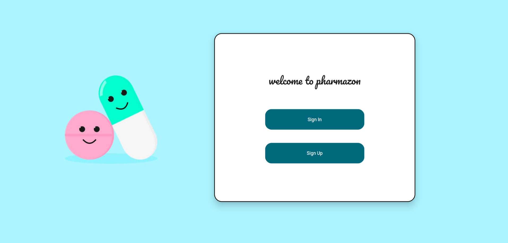
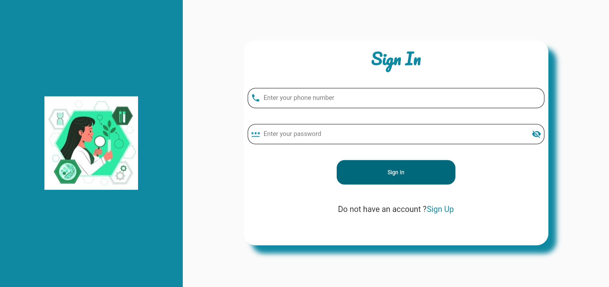
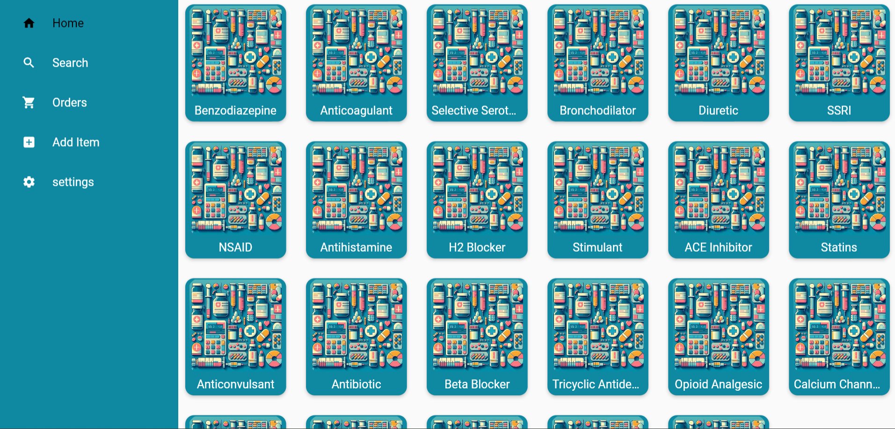
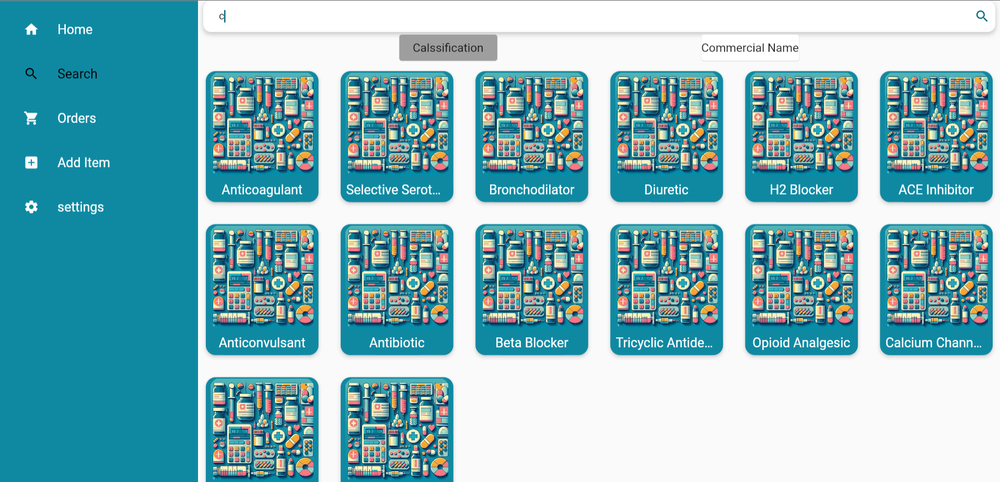
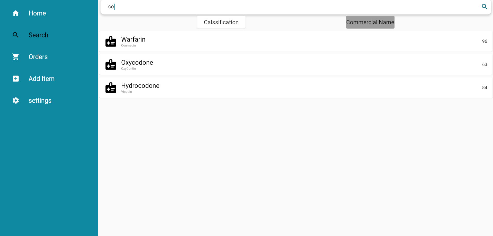
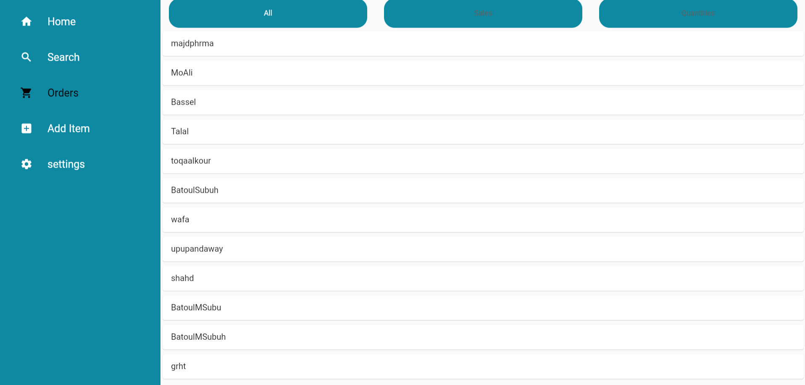
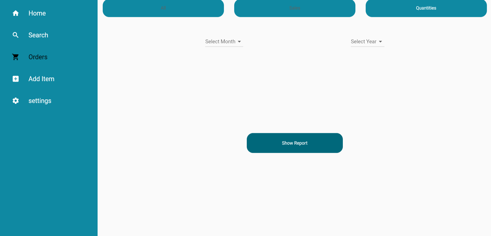
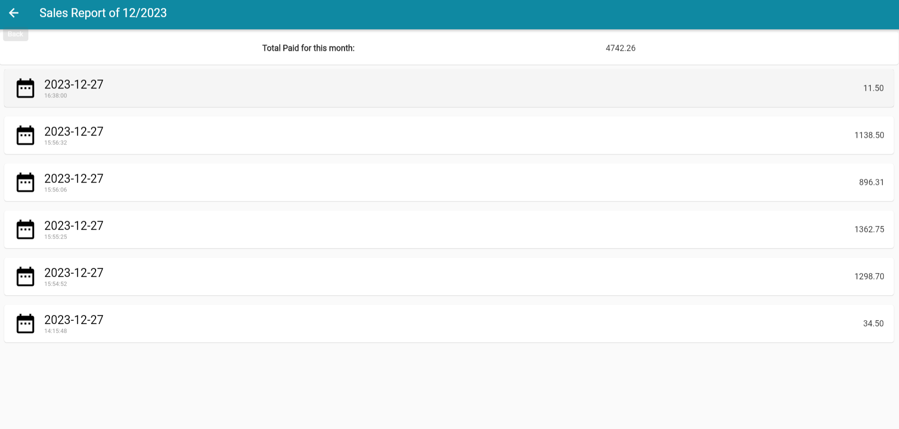
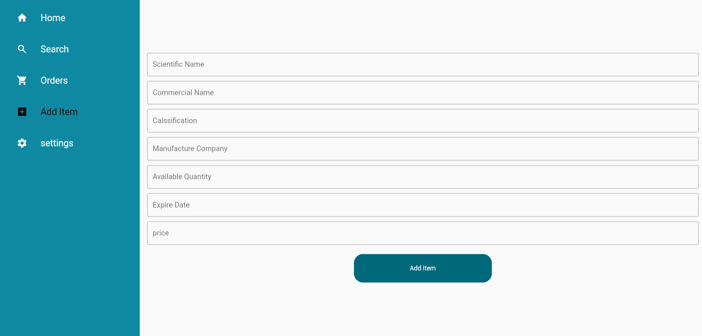
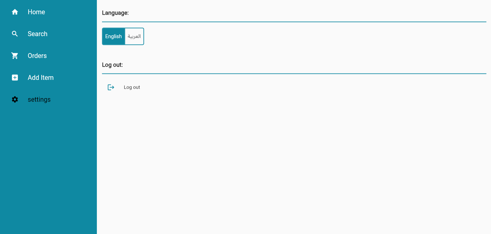
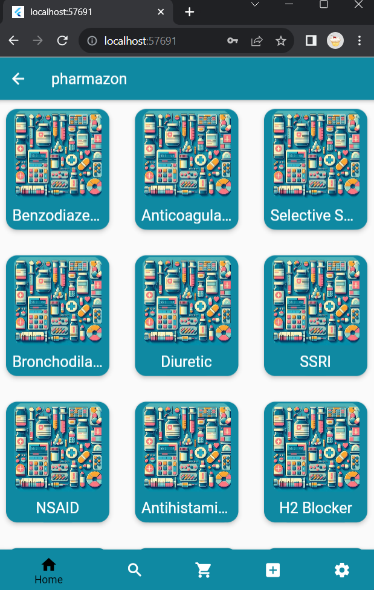

## License

This project is licensed under the [MIT License](LICENSE).
